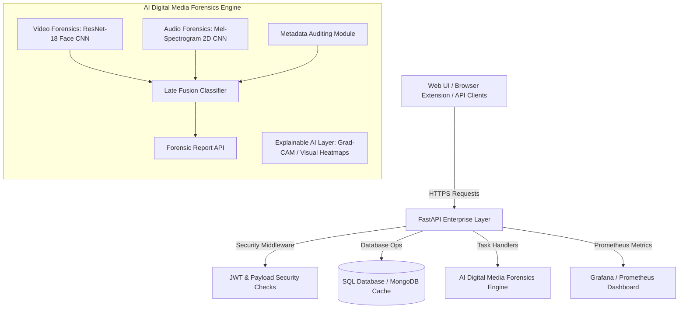

# 🎭 AI Digital Media Forensics & Deepfake Verification Platform

An enterprise-grade, research-level AI Digital Media Forensics Platform designed to verify and audit digital content. It features multimodal verification modules (Video CNN + Audio CNN) with comprehensive explainability layers, and scales to high-throughput containerized environments.

---

## 🏛️ Platform Architecture Overview



---

## 📚 Documentation Center

To learn about specific parts of the platform infrastructure, refer to these sub-documents:

1.  **[System Architecture & Design Patterns (docs/ARCHITECTURE.md)](file:///d:/Downloads/deepfake-detection-main/docs/ARCHITECTURE.md)**: Deep dive into the Bounded Contexts, Bounded Domain schemas, Clean Architecture design, and Late Fusion algorithm specs.
2.  **[Installation & Local/Docker Setup (docs/INSTALLATION.md)](file:///d:/Downloads/deepfake-detection-main/docs/INSTALLATION.md)**: Detailed configuration guides for setting up virtual environments, installing FFmpeg, and running CPU/GPU Docker Swarms with Grafana telemetry.
3.  **[Developer Guide & Code Standards (docs/DEVELOPER_GUIDE.md)](file:///d:/Downloads/deepfake-detection-main/docs/DEVELOPER_GUIDE.md)**: Code formatting rules, auto-format commands (`make format`), and a step-by-step tutorial on registering new deep learning models.
4.  **[Production Readiness & Security (docs/PRODUCTION_READINESS.md)](file:///d:/Downloads/deepfake-detection-main/docs/PRODUCTION_READINESS.md)**: Security validations checklist, horizontal auto-scaling design, and the long-term project development roadmap.

---

## 📂 Project Structure

```
deepfake-forensics-platform/
├── app/                        # Main Web Application & API Gateways
│   ├── api/                    # API sub-versions
│   ├── authentication/         # JWT validations & User Roles configurations
│   ├── middleware/             # CORS policies & Upload Size Security Middleware
│   ├── routes/                 # FastAPI controllers (/upload, /predict, /health, etc.)
│   ├── database/               # SQL Connection managers and SQLAlchemy schemas
│   ├── schemas/                # Request & Response data validation contracts (Pydantic v2)
│   ├── utils/                  # Centralized logging, bootstrap engines, and custom exception handler mapping
│   ├── config/                 # Pydantic Settings loaders for Dev, Testing, and Production
│   └── main.py                 # ASGI Master Application bootstrap entry point
│
├── ai_engine/                  # Deep learning forensics algorithms and pipelines
│   ├── video/                  # Facial CNN feature extraction routines
│   ├── audio/                  # Mel Spectrogram analysis operations
│   ├── metadata/               # EXIF/JFIF and audio container metadata parsing
│   ├── explainability/         # Heatmap generation and attribution models (e.g., Grad-CAM)
│   ├── fusion/                 # Multimodal classifier fusion algorithms
│   ├── preprocessing/          # OpenCV frame slice & Librosa wave decoders
│   ├── feature_extraction/     # Embedding processors for downstream classifiers
│   ├── training/               # Distributed model training parameters
│   ├── inference/              # Inference runner under CUDA contexts
│   ├── evaluation/             # Metrics collectors (Precision/Recall, F1)
│   └── datasets/               # Benchmark dataset registration schemas (Registry configuration)
│
├── storage/                    # Physical persistence layer
│   ├── uploads/                # Temporary user uploads buffer
│   ├── reports/                # Output PDF/JSON forensic audits
│   └── dataset_cache/          # Cache for downloaded raw files
│
├── monitoring/                 # Monitoring configurations
│   ├── prometheus/             # Scraping configurations for Prometheus server
│   └── grafana/                # Dashboards for telemetry
│
├── tests/                      # Pytest suites
└── Dockerfile                  # Multi-stage production container
```

---

## 🚀 Quick Start
To immediately build and spin up the complete API platform integrated with Prometheus metrics scraping and Grafana dashboard:
```bash
docker-compose up --build -d
```
*   **FastAPI API Endpoint**: [http://localhost:8000](http://localhost:8000)
*   **Interactive Swagger Documentation**: [http://localhost:8000/docs](http://localhost:8000/docs)
*   **Prometheus Console**: [http://localhost:9090](http://localhost:9090)
*   **Grafana Dashboard**: [http://localhost:3000](http://localhost:3000)
