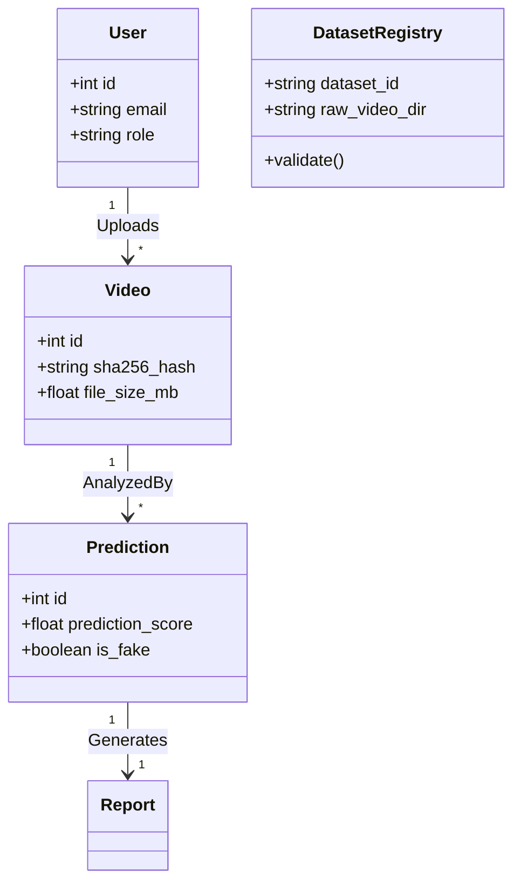

# 🏛️ Forensic Platform System Architecture & DDD Layout

This document details the software design patterns, architectural flow, and Domain-Driven Design (DDD) domain mappings of the AI Media Forensics Platform.

---

## 1. Clean Architecture Mapping

The platform enforces a strict separation of concerns, dividing the codebase into four concentric layers to decouple business use cases from UI, frameworks, and database drivers.

```
                    ┌──────────────────────────────────────────────┐
                    │ INFRASTRUCTURE (SQLAlchemy, Prometheus, Docker)│
                    │   ┌──────────────────────────────────────┐   │
                    │   │  PRESENTATION (FastAPI Routes, DTOs)  │   │
                    │   │   ┌──────────────────────────────┐   │   │
                    │   │   │  APPLICATION (Use Cases,     │   │   │
                    │   │   │  Services Orchestrators)     │   │   │   │
                    │   │   │   ┌──────────────────────┐   │   │   │   │
                    │   │   │   │  CORE DOMAIN         │   │   │   │   │
                    │   │   │   │  (AI Models, Fusion) │   │   │   │   │
                    │   │   │   └──────────────────────┘   │   │   │   │
                    │   │   └──────────────────────────────┘   │   │   │
                    │   └──────────────────────────────────────┘   │
                    └──────────────────────────────────────────────┘
```

*   **Core Domain (Entities & Modalities)**:
    *   Located in `ai_engine/`. Represents the core mathematics and model weights of the deep learning architecture.
    *   No dependencies on external web frameworks or ORMs.
*   **Application Services**:
    *   Located in `app/services/`. Orchestrates actions such as loading files, calling AI predictions, generating reports, and tracking runs.
*   **Presentation / Interface Adapters**:
    *   Located in `app/routes/` and `app/schemas/`. Translates API payload parameters to Pydantic objects, handles auth tokens, and yields HTTP responses.
*   **Infrastructure**:
    *   Located in `app/database/`, `app/config/`, and `monitoring/`. Integrates third-party tool configurations (databases, container properties, metrics scrapers).

---

## 2. Domain-Driven Design (DDD) Boundaries



### Bounded Contexts
1.  **Ingestion & Security Context**:
    *   Manages files incoming to `/upload`. Performs size limit checks, formats verification, and path security sanitization.
2.  **Detection & Inference Context**:
    *   Manages execution of deep learning models. Handles GPU context loading and multi-modal late fusion.
3.  **Auditing & Forensics Reporting Context**:
    *   Compiles prediction scores, visual attribution maps (Grad-CAM), and metadata into printable audit reports.

---

## 3. Multimodal Classifier Late Fusion Design

The platform uses a late fusion model. Rather than combining raw features at the input level, the platform processes the video track and the audio track through independent deep CNN networks.

```
Face Crop (Image) ──► [ Video ResNet-18 ] ──► Visual Probability (Pv) ──┐
                                                                       ├──► [ Late Fusion ] ──► Class (Real/Fake)
Audio Spectrogram ──► [ Audio 2D CNN ]    ──► Vocal Probability (Pa)  ──┘
```

*   **Visual Probability ($P_v$)**: Attained by running face crops through the ResNet-18 network.
*   **Vocal Probability ($P_a$)**: Attained by running the Mel Spectrogram features through the Audio CNN.
*   **Late Fusion Formula**:
    $$P_{\text{final}} = w_v \cdot P_v + w_a \cdot P_a$$
    *(Where weights $w_v$ and $w_a$ are dynamically optimized during multimodal model training).*
